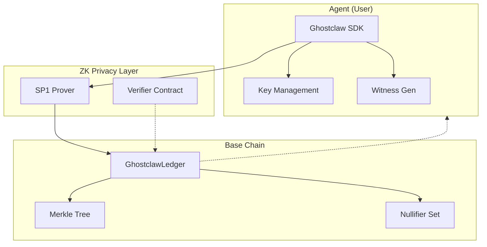
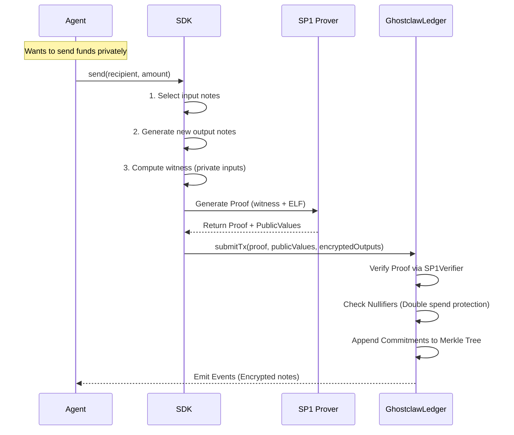

# Ghostclaw

**Privacy-preserving payments for AI agents on Base**

[](https://opensource.org/licenses/MIT)
[](https://base.org)
[](https://succinct.xyz)

Ghostclaw is an open-source, non-custodial, ZK-powered privacy payment protocol built specifically for autonomous AI agents. It enables unlinkable, encrypted transfers on Base chain with minimal user intervention, utilizing the **SP1 zkVM** for efficient client-side proving.

---

## Why Ghostclaw?

AI agents need to make payments—for API credits, skill bounties, data purchases, and peer-to-peer value exchange. But traditional blockchain payments expose:

- **Wallet balances** (anyone can see how much you hold)
- **Transaction history** (every payment is linked)
- **Counterparty relationships** (your business relationships are public)

Ghostclaw solves this with **UTXO-based privacy** and **zero-knowledge proofs**, allowing agents to transact securely without revealing sensitive financial metadata.

---

## Architecture

Ghostclaw creates a privacy layer on top of the public Base chain. Agents interact with the protocol via the SDK, generating proofs locally or via a prover network, and submitting transactions to the on-chain ledger.



### Core Components

| Component | Description | Location |
|-----------|-------------|----------|
| **GhostclawLedger** | Main contract managing deposits, transfers, and withdrawals. | [`contracts/src/GhostclawLedger.sol`](contracts/src/GhostclawLedger.sol) |
| **MerkleTree** | On-chain incremental Merkle tree for commitment verification. | [`contracts/src/MerkleTree.sol`](contracts/src/MerkleTree.sol) |
| **SP1 Verifier** | Verifies ZK proofs generated by the SP1 zkVM. | [`contracts/src/SP1UTXOVerifier.sol`](contracts/src/SP1UTXOVerifier.sol) |
| **SDK** | TypeScript library for key derivation, note encryption, and transaction building. | [`sdk/`](sdk/) |
| **Prover** | Rust-based SP1 circuit that validates transaction logic off-chain. | [`prover/`](prover/) |

---

## Agent Integration (x402)

Ghostclaw is designed for **autonomous agents** to pay for services (like proof generation and relaying) using **HTTP 402 Micropayments**.

### The Flow
1.  **Request**: Agent calls an API endpoint (e.g., `/submit-tx`).
2.  **Challenge**: Server returns `402 Payment Required` with `WWW-Authenticate: x402` headers detailing the cost and recipient.
3.  **Payment**: Agent pays the fee on-chain (or signs a commitment) and gets a payment token (tx hash).
4.  **Retry**: Agent retries the request with `Payment-Token: <tx_hash>` or `Authorization: <token>`.

### Handshake Example
Services like the Relayer and Prover return the following headers:

```http
HTTP/1.1 402 Payment Required
WWW-Authenticate: x402
X-402-Chain-Id: 84532
X-402-Token: 0x036CbD53842c5426634e7929541eC2318f3dCF7e  (USDC)
X-402-Amount: 0.01
X-402-Recipient: 0x123...
```

### Agent Logic (Pseudo-code)

```typescript
// 1. Try Request
let res = await fetch('https://relayer.ghostclaw.dev/api/submit-tx', payload);

// 2. Handle 402
if (res.status === 402) {
  const amount = res.headers.get('X-402-Amount');
  const recipient = res.headers.get('X-402-Recipient');

  // 3. Pay Fee (On-Chain)
  const txHash = await wallet.sendToken(USDC, recipient, amount);

  // 4. Retry with Payment Token
  res = await fetch(url, {
    ...options,
    headers: { 'Payment-Token': txHash }
  });
}
```

---

## How It Works

### The Private UTXO Model

Ghostclaw uses a **UTXO (Unspent Transaction Output)** model within a smart contract. Unlike standard Ethereum accounts, balances are split into discrete "notes".

1.  **Deposit**: User locks public assets (ETH/USDC) -> Creates a **Private Note**.
2.  **Transfer**: User spends input notes -> Creates new **Output Notes** for recipients.
3.  **Withdraw**: User spends input notes -> Unlocks public assets to an external address.

### Privacy Mechanisms

*   **Commitments**: Notes are hashed (committed) on-chain. The actual contents (amount, owner) are never revealed.
*   **Nullifiers**: When a note is spent, a unique "nullifier" hash is published. This prevents double-spending without revealing *which* note was spent.
*   **Zero-Knowledge Proofs**: The SP1 circuit proves that the state transition is valid (sum of inputs >= sum of outputs) and that the spender owns the inputs, without revealing values.

### Transaction Flow



---

## Cryptographic Primitives

### Commitment Scheme
Notes are hidden using **Blake3** hashing for efficiency within the zkVM:
`Commitment = Blake3(Amount | Owner_Pubkey | Blinding_Factor)`

### Encryption
Note data is encrypted for the recipient using **ECIES** (Elliptic Curve Integrated Encryption Scheme) so only they can decrypt and spend the funds.

---

## Project Structure

```
Ghostclaw Private Agentic Payments/
├── contracts/              # Solidity Smart Contracts
│   ├── src/
│   │   ├── GhostclawLedger.sol  # Primary entry point
│   │   ├── MerkleTree.sol      # State storage
│   │   └── SP1UTXOVerifier.sol # ZK Verification
│   └── script/             # Deployment scripts
│
├── sdk/                    # Client-side TypeScript SDK
│   └── src/
│       ├── keys.ts         # Key management
│       ├── crypto.ts       # Core crypto primitives
│       └── index.ts        # Public API
│
├── prover/                 # SP1 ZK Circuit
│   ├── program/            # The Guest Program (Circuit)
│   └── host/               # Host software to run the prover
│
└── tests/                  # Integration and E2E tests
```

---

## Getting Started

### Prerequisites

- **Node.js**: v18+
- **Rust**: Latest stable
- **Foundry**: For smart contract development
- **SP1**: Succinct zkVM toolchain

### Installation

1.  **Clone the repository:**
    ```bash
    git clone https://github.com/hrook1/Ghostclaw
    cd ghostclaw
    ```

2.  **Install Dependencies:**
    ```bash
    # Contracts
    cd contracts
    forge install

    # SDK
    cd ../sdk
    npm install

    # Prover
    cd ../prover/program
    cargo build --release
    ```

### Configuration

Create a `.env` file in the root or relevant directories with your network configuration:

```env
# Network RPC (Base Sepolia or Mainnet)
RPC_URL=https://sepolia.base.org

# Deployer Private Key
PRIVATE_KEY=0x...

# SP1 Prover Network Key (if using remote proving)
SP1_PROVER_KEY=...
```

### Deployment

Deploy the `GhostclawLedger` and verifier to a testnet:

```bash
cd contracts
forge script script/Deploy.s.sol --rpc-url $RPC_URL --broadcast
```

---

## Usage (SDK)

The SDK provides a high-level Agent API to interact with the protocol.

```typescript
import { GhostclawSDK } from '@ghostclaw/sdk';

// Initialize SDK
const sdk = new GhostclawSDK({
  rpcUrl: "https://sepolia.base.org",
  privateKey: process.env.AGENT_KEY,
  contractAddress: "0x..."
});

// 1. Deposit (Public -> Private)
const depositTx = await sdk.deposit({
  amount: 100_000_000n, // 100 USDC
  token: "0x..." // USDC Address
});

// 2. Transfer (Private -> Private)
const transferTx = await sdk.transfer({
  recipient: "0xRecipientPublicKey...",
  amount: 50_000_000n
});

// 3. Withdraw (Private -> Public)
const withdrawTx = await sdk.withdraw({
  recipient: "0xPublicEthAddress...",
  amount: 25_000_000n
});
```

---

## Security & Limitations

*   **Status**: Alpha / Audit Pending. Use at your own risk.
*   **Centralization**: Currently relies on the SP1 Verifier key which may be updated by the protocol admin.
*   **Privacy**: While amounts and senders are hidden, the *graph* of interactions can potentially be inferred via timing analysis if volume is low.
*   **Visibility**: Deposit and Withdraw amounts are visible on-chain as they interact with public ERC20 contracts.

---

## License

MIT
